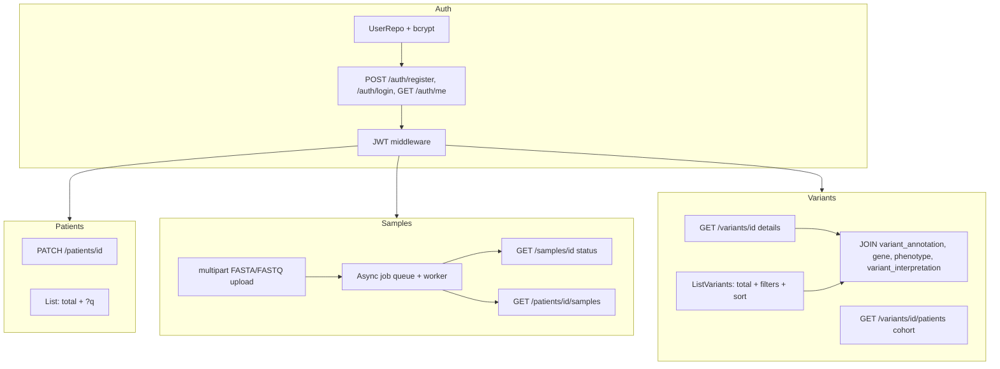

# План доработок бэкенда под требуемый фронт

Документ фиксирует gap между текущим состоянием бэкенда и требуемым фронтом
(регистрация/вход, добавление пациента, загрузка ридов, таблица вариантов
с просмотром когорты «пациенты с тем же вариантом» и всеми столбцами).

База кода на момент анализа:
- роутер: [`router.New()`](backend/internal/router/router.go:17)
- хендлеры: [`PatientHandler`](backend/internal/handlers/patient_handler.go:17), [`VariantHandler`](backend/internal/handlers/variant_handler.go:20)
- репозитории: [`PatientRepo`](backend/internal/repository/patient_repo.go:18), [`VariantRepo`](backend/internal/repository/variant_repo.go:16)
- модели: [`models.Patient`](backend/internal/models/models.go:6), [`models.PatientVariant`](backend/internal/models/models.go:47)
- таблица пользователей: [`docker/initdb/20-user-table.sql`](docker/initdb/20-user-table.sql:5)

---

## 1. Текущее состояние по экранам фронта

| Экран | Готовность | Что есть сейчас |
|---|---|---|
| Регистрация / Вход | ❌ 0% | Таблица `public."user"` существует в БД, но в Go-коде нет ни модели, ни репозитория, ни хендлеров. |
| Создание пациента | ✅ ~95% | `POST /api/patients` принимает все нужные поля. Нет PATCH. |
| Загрузка ридов | ⚠️ ~60% | `POST /api/patients/{id}/align` принимает JSON-массив строк-последовательностей, работает синхронно. Нет multipart, нет статусов задач, нет списка sample'ов. |
| Таблица вариантов | ⚠️ ~50% | `GET /api/patients/{id}/variants` отдаёт `PatientVariant`. Нет когорты, нет аннотаций/гена/фенотипа/интерпретации, нет `total`, нет фильтров/сортировки. |

---

## 2. Полный план доработок

### 2.1. Модуль аутентификации (Auth)

**Цель:** покрыть форму регистрации и форму входа.

Новые файлы:
- `backend/internal/models/user.go` — `User`, `UserCreate`, `Credentials`, `AuthResponse`.
- `backend/internal/repository/user_repo.go` — `UserRepo` с методами:
  - `Create(ctx, UserCreate) (User, error)` — bcrypt password_hash.
  - `GetByUsername(ctx, username) (User, string, error)` — вернуть user + hash.
  - `GetByID(ctx, id) (User, error)`.
- `backend/internal/auth/jwt.go` — `Issue(userID, role) (token, exp, error)`, `Parse(token) (Claims, error)` на HS256, секрет из config.
- `backend/internal/auth/password.go` — обёртка над `golang.org/x/crypto/bcrypt`.
- `backend/internal/handlers/auth_handler.go`:
  - `POST /api/auth/register` — создаёт пользователя (role по умолчанию `viewer`), возвращает JWT.
  - `POST /api/auth/login` — проверяет пароль, возвращает JWT.
  - `GET /api/auth/me` — возвращает текущего пользователя по JWT.
- `backend/internal/router/auth_mw.go` — middleware `RequireAuth`, кладёт `Claims` в `context`.

Изменения:
- [`backend/internal/config/config.go`](backend/internal/config/config.go:1) — добавить `JWTSecret`, `JWTTTL` из env.
- [`backend/internal/router/router.go`](backend/internal/router/router.go:38) — выделить публичную группу `/api/auth/*` и защищённую `/api/*` под `RequireAuth`.
- [`backend/cmd/api/main.go`](backend/cmd/api/main.go:1) — собрать `UserRepo`, `AuthHandler` и прокинуть в роутер.
- `backend/go.mod` — добавить `golang.org/x/crypto`, `github.com/golang-jwt/jwt/v5`.

DDL: уже есть в [`docker/initdb/20-user-table.sql`](docker/initdb/20-user-table.sql:5), доработок не требует.

### 2.2. Пациенты: расширение

- Добавить `PATCH /api/patients/{id}` → `PatientHandler.Update` для редактирования из формы.
- Добавить в `List` поле `total` (отдельный `SELECT count(*)`), чтобы фронт мог рисовать пагинацию.
- Опционально: фильтр по подстроке имени/фамилии (`?q=`).

### 2.3. Загрузка ридов: multipart + асинхронность

**Цель:** позволить фронту загружать FASTA/FASTQ файлом, не блокируя UI.

Изменения схемы пайплайна:
- В [`models.AlignRequest`](backend/internal/models/models.go:95) сделать ввод гибким:
  - вариант A — оставить JSON `{ reads: [...] }` для совместимости;
  - вариант B — `POST /api/patients/{id}/samples` с `multipart/form-data`:
    - поле `sample_name` (text),
    - поле `file` (FASTA/FASTQ, опционально gz).
  - Парсер файла в `backend/internal/pipeline/fasta.go` / `fastq.go` (стримом).

Асинхронная схема:
- `POST /api/patients/{id}/samples` — сразу создаёт запись в `sample` со статусом `pending`, кладёт задачу в in-memory очередь (горутина-воркер), возвращает `202 Accepted` с `sample_id` и `status`.
- Воркер запускает существующий [`pipeline.Pipeline.Run`](backend/internal/pipeline/pipeline.go:1) → парсит VCF → сохраняет через [`VariantRepo.SavePipelineResults`](backend/internal/repository/variant_repo.go:103). Обновляет `processing_status` в `sample`.
- `GET /api/samples/{id}` — статус и метаданные.
- `GET /api/patients/{id}/samples` — список образцов пациента.

Новые файлы:
- `backend/internal/jobs/queue.go` — очередь задач с workerpool (контролируемый параллелизм).
- `backend/internal/handlers/sample_handler.go` — `Upload`, `Get`, `List`.
- `backend/internal/pipeline/fasta.go` — разбор multipart-стрима в `[]string` (или передача файла как есть в bwa).

Изменения:
- В [`router.go`](backend/internal/router/router.go:38) добавить ветку `/samples` и `/patients/{id}/samples`.
- Старый синхронный `/align` пометить deprecated или удалить.
- Поднять `MaxMultipartMemory` и file-size limit в конфиге.

### 2.4. Варианты: когорта, аннотации, фильтры

**Новые ручки:**

- `GET /api/variants/{id}` — деталка варианта со всеми связанными таблицами:
  - `variant` + `variant_annotation` + `gene` + `phenotype` (через `gene_phenotype`) + `variant_interpretation`.
- `GET /api/variants/{id}/patients` — когорта пациентов с этим же вариантом:
  - `SELECT patient ... FROM patient_variant pv JOIN patient p ON p.patient_id = pv.patient_id WHERE pv.variant_id = $1`
  - с пагинацией и `total`.
- (Опц.) `GET /api/variants?chrom=&pos=&ref=&alt=&build=` — поиск варианта по координатам.

**Доработка существующей `ListVariants`:**
- Добавить `total` в ответ.
- Параметры фильтра: `?chrom=`, `?variant_type=SNV|INS|DEL|MNV|OTHER`, `?filter=PASS`, `?min_qual=`, `?zygosity=`.
- Параметр сортировки `?sort=chrom,position|-quality|...`.
- Включить в выдачу аннотации (LEFT JOIN на `variant_annotation`, можно агрегировать `jsonb_agg`).

**Новые методы в `VariantRepo`:**
- `GetVariantDetails(ctx, variantID) (VariantDetails, error)`.
- `ListPatientsByVariant(ctx, variantID, limit, offset) ([]Patient, int, error)`.
- `ListPatientVariantsFiltered(ctx, patientID, filter VariantFilter) ([]PatientVariant, int, error)`.

**Новые модели:**
- `VariantAnnotation`, `Gene`, `Phenotype`, `VariantInterpretation`, `VariantDetails` (агрегат).
- `VariantFilter` (struct для фильтрации).

### 2.5. Общая инфраструктура

- Унифицировать пагинацию: вспомогательная структура `PageResponse[T]{ items, total, limit, offset }`.
- В [`router.go`](backend/internal/router/router.go:25) переключить CORS на конкретный origin фронта (из env), включить `AllowCredentials: true` если используем cookie-сессии (сейчас план — Bearer JWT, можно оставить `false`).
- Логирование auth-событий (успех/неудача входа) через [`logging`](backend/internal/logging/logging.go:1).

---

## 3. Маршрутная карта (mermaid)

---

## 4. Порядок реализации (рекомендуемый)

1. **Auth (2.1)** — без него фронт не пройдёт даже первый экран.
2. **Variants extensions (2.4)** — самая «мясная» функциональность таблицы, нужна для основной ценности продукта.
3. **Samples async upload (2.3)** — UX-критично; без него длинные пайплайны вешают форму.
4. **Patients PATCH + total (2.2)** — мелкая полировка.
5. **Pagination/CORS/logging unify (2.5)** — выносим в финальный проход.

---

## 5. Acceptance criteria

- [ ] Фронт может зарегистрировать пользователя, залогиниться, держать сессию через JWT.
- [ ] Все защищённые `/api/*` ручки возвращают `401` без валидного токена.
- [ ] Форма пациента создаёт и редактирует запись; список отдаёт `total`.
- [ ] Форма загрузки принимает файл, не блокируется на время пайплайна, показывает прогресс через polling `GET /api/samples/{id}`.
- [ ] Таблица вариантов: пагинация с `total`, фильтры (chrom/type/filter/min_qual), сортировка, аннотации в строке.
- [ ] По клику на вариант фронт получает список пациентов с тем же `variant_id` (когорта).
- [ ] Деталка варианта отдаёт gene/phenotype/annotation/interpretation.
